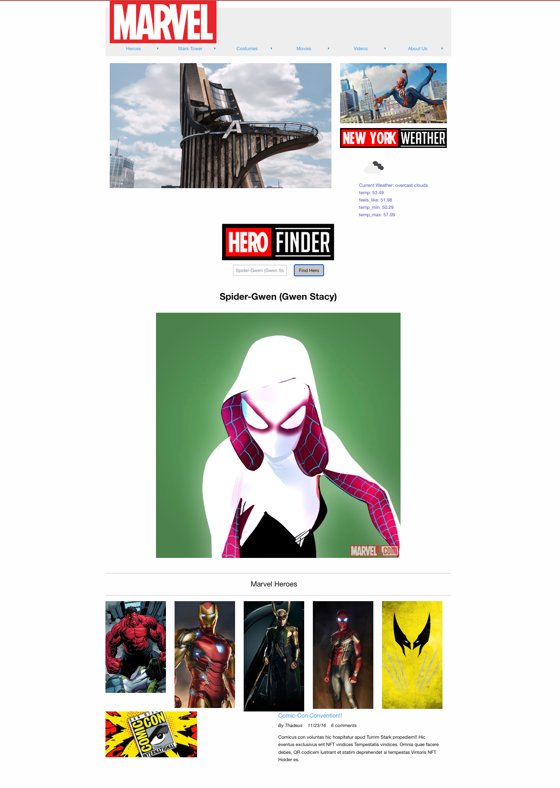

<!-- @format -->

# Group-Project "Weather Avengers"

We are the Weather Avengers!
Our application is a domain based on Marvel super heroes. Within our site you can do a search for all Marvel Heroes
that drops a description about them and also a photo of the character. This information is being pulled from the Marvel API (https://developer.marvel.com/).
Along with our application, it also pulls the current weather of our headquarters location over at 'Stark Tower'. The weather information is being pulled
from the https://openweathermap.org/ API.
The overall vision for the application we created is to gather Marvel fans all over the world to a centralize hub.

[Repository])(https://github.com/AndresSilva1/Group-Project)
[Webpage](https://andressilva1.github.io/Group-Project/)

